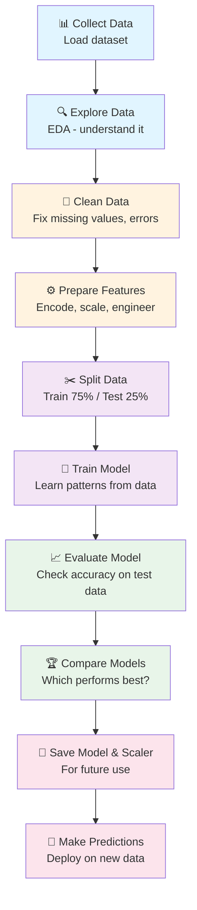
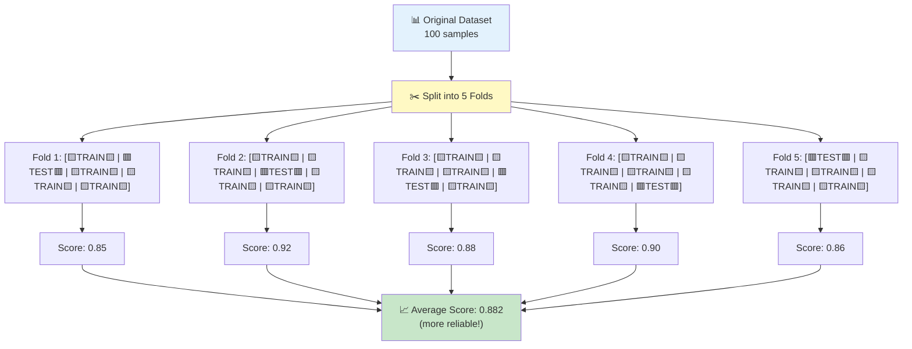

# 🚀 Machine Learning for Beginners: Simple & Exciting Edition

> **The Goal**: Learn ML by building real projects, not memorizing formulas!

---

## 🎮 What's Machine Learning? (In 30 Seconds)

**You teach a computer to recognize patterns. Then it predicts stuff for you.**

Example: You show a computer 1000 cat pictures → It learns what cats look like → You show it a new cat picture → It says "That's a cat!" 🐱

That's it. That's ML.

---

## ⚡ Your Learning Path (4 Weeks)

```
Week 1: UNDERSTAND DATA
  📊 Learn statistics basics
  🎲 Learn probability
  
Week 2: PREPARE DATA
  🧹 Clean messy data
  📏 Make features comparable
  
Week 3: TRAIN MODELS
  🤖 Teach computer to predict
  📈 Check if it works
  
Week 4: BUILD PROJECTS
  🎯 Train real models
  💾 Save and deploy
```

---

## 🎯 Core Concepts (5 Simple Things to Know)

| # | Concept | What It Does | Example |
|---|---------|-------------|---------|
| 1️⃣ | **Data** | Your training material | 1000 house prices |
| 2️⃣ | **Features** | What you measure | Size, location, age |
| 3️⃣ | **Target** | What you predict | House price $$$ |
| 4️⃣ | **Model** | The learning machine | Neural net, Linear Reg |
| 5️⃣ | **Training** | Teaching the machine | Show examples, learn patterns |

---

## 📚 Quick Navigation

- **Confused about data?** → [Section 2: Statistics 101](#quick-statistics)
- **What's probability?** → [Section 3: Probability Basics](#quick-probability)
- **How do models learn?** → [Section 9: Gradient Descent](#how-models-learn)
- **Which model should I use?** → [Section 8.3: Model Selection](#model-selection-tree)
- **How do I know if my model is good?** → [Section 10: Metrics](#evaluation-metrics-simple)

---

---

# 1. Machine Learning Big Picture

Machine Learning is the process of training a model to learn patterns from data and make predictions on unseen data.

### Beginner Analogy
Imagine teaching a child to recognize dogs:
- You show them **many pictures of dogs** (training data)
- They learn common patterns: **four legs, fur, wet nose** (features)
- They learn the **pattern that makes something a dog** (model learning)
- Later, they see a **new dog picture** they've never seen (test data)
- They recognize it's a dog even though it's new (prediction)

## 1.1 Full ML Workflow



**Key Principle**: Train on one set of data, test on a completely different set. This tells you if your model actually learned, or just memorized.

## 1.2 Two Types of Learning

When a model learns, it does so in one of two ways:

### Instance-Based Learning (Memorization)
The model memorizes training examples and compares new data to them.

**Analogy**: Like remembering exact phone numbers. If someone asks "what's the 5th person I called?", you look at your call history.

| Feature | Description |
|---|---|
| How it learns | Memorizes patterns |
| Decision making | Compares to stored examples |
| Training speed | Fast |
| Prediction speed | Slow |
| Storage needed | High (must keep all training data) |
| Example | K-Nearest Neighbors (KNN) |

### Model-Based Learning (Generalization)
The model learns general patterns/rules and forgets the training data.

**Analogy**: Like learning grammar rules. You learn "verb + ed = past tense," so you can conjugate ANY verb, not just ones you studied.

| Feature | Description |
|---|---|
| How it learns | Learns underlying patterns/rules |
| Decision making | Uses learned rules/equation |
| Training speed | Slow (learns patterns) |
| Prediction speed | Fast (just apply the rule) |
| Storage needed | Low (just store the rule) |
| Examples | Linear Regression, Decision Trees, Neural Networks |

**Which is better?** Model-based learning usually generalizes better to new data.

---

# 2️⃣ Statistics 101: Understand Your Data

> **Why?** Before teaching a computer anything, YOU need to understand the data!

---

## 🎯 The 3 Questions Statistics Answers

```
Question 1: What's typical?        → MEAN (average)
Question 2: How spread out?        → STANDARD DEVIATION
Question 3: Any weird values?      → OUTLIERS
```

---

## 📊 Mean (Average) - The Typical Value

**What it is**: Add all numbers, divide by count.

```
Heights: [5ft, 6ft, 5.5ft]
Mean = (5 + 6 + 5.5) / 3 = 5.5 ft
"On average, people are 5.5ft tall"
```

✅ **Use when**: Normal, spread-out data
⚠️ **Problem**: One giant person ruins it!

---

## 📈 Standard Deviation - How Spread Out?

**What it is**: "How different are values from the average?"

```
City A temps:  68°, 68°, 69°, 68°  → Same every day (small std dev)
City B temps:  50°, 70°, 68°, 66°  → Changes a lot (big std dev)
```

**Rule of Thumb**: 68% of data within ±1 std dev

```
Test scores: Mean=70, Std Dev=5
68% of students scored between 65-75 ✅
```

---

## ⚠️ Outliers - Weird Values to Watch

**What they are**: Values WAY different from the rest.

```
House prices: [300k, 350k, 320k, 400k, $50 MILLION 🚨]
                                       ↑ OUTLIER!
```

### 🔍 How to Spot Them (IQR Method)

```
Step 1: Find middle 50% of data
        Q1 (bottom 25%) = 300k
        Q3 (top 25%) = 400k

Step 2: Calculate spread
        IQR = Q3 - Q1 = 100k

Step 3: Find "normal range"
        Lower limit = Q1 - 1.5×IQR = 150k
        Upper limit = Q3 + 1.5×IQR = 550k

Step 4: Mark outliers
        50M > 550k? YES = OUTLIER! 🚨
```

### What to Do?

```
❌ DELETE IT         → If it's a data error
✅ KEEP IT           → If it's real and important
🎯 CAP IT            → Replace with limit value
```

---

## 🎲 Data Types (What Kind of Data?)

```
CATEGORICAL (Groups, not numbers)
  🏠 Color: Red, Blue, Green
  👥 Gender: Male, Female
  
NUMERICAL (Numbers we can use)
  📏 Height: 5.5, 6.2, 5.9
  💰 Salary: 50000, 75000, 100000
```

**Why it matters**: Different data types need different handling!

---

## ✂️ Quick Checklist: Understand Your Data

- [ ] How many rows/columns? `df.shape`
- [ ] What types? `df.info()`
- [ ] Any missing values? `df.isnull().sum()`
- [ ] What's typical? `df.describe()`
- [ ] Any outliers? `df.describe()` look for min/max

---

---

# 3️⃣ Probability: What Are the Odds?

> **Why?** ML models often predict probabilities ("85% chance this is spam")

---

## 🎲 What's Probability? (Super Simple)

**Probability** = Chance of something happening

```
0 = Impossible (will never happen)
0.5 = 50-50 chance
1 = Certain (will definitely happen)
```

**Example**: Fair coin flip
```
P(heads) = 0.5 = 50% chance
P(tails) = 0.5 = 50% chance
```

---

## 🎯 2 Formulas You Need

### Formula 1: "A OR B?"

**Can't happen together**:
```
P(A or B) = P(A) + P(B)
Example: Die shows 2 OR 5
P = 1/6 + 1/6 = 2/6 = 33%
```

**Can happen together**:
```
P(A or B) = P(A) + P(B) - P(A∩B)
Example: Card is King OR Heart
(King of Hearts is both, subtract it!)
P ≈ 30%
```

### Formula 2: "A AND B?"

**Independent** (one doesn't affect other):
```
P(A and B) = P(A) × P(B)
Example: Heads AND roll 3
P = 0.5 × 1/6 = 8%
```

**Dependent** (one affects other):
```
P(A and B) = P(A) × P(B|A)
Example: 2 cards without replacing
P(both Kings) ≈ 0.45%
```

---

## 🧠 Real-World ML Examples

```
✅ "87% this email is spam" = 87% probability
✅ "92% chance customer buys" = 92% probability  
✅ "15% chance person has disease" = 15% probability
```

---

# 4️⃣ Probability Distributions: Common Patterns

> **Idea**: Different problems have different patterns. Recognize the pattern → Choose the right model!

---

## 📊 What's a Distribution?

**Distribution** = How likely are different outcomes?

```
Test Scores: [60, 65, 70, 75, 75, 75, 80, 85, 90]
Most people score around 75 (peak)
Few people score very low or very high
This pattern = a distribution
```

---

## 🎯 3 Distributions That Matter

### 1️⃣ Normal Distribution (The Bell Curve) 📈

**When**: Used in almost everything (height, test scores, errors)

```
        Peak at middle
          📊
         /  \
       /      \
     /          \
   /              \
-3σ  -2σ  -1σ   0   +1σ  +2σ  +3σ

68% of data here (within 1 std dev)
95% of data here (within 2 std devs)
```

**Rule of Thumb**:
- Most data clusters in middle ✅
- Few extremes on both sides ✅
- Perfect bell shape ✅

### 2️⃣ Binomial Distribution (Repeated Yes/No) 🎯

**When**: Flipping coin 10 times, sending 100 emails, running test 5 times

```
"How many successes in N tries?"
Example: Flip coin 10 times → how many heads?
Answer: Could be 0, 1, 2, 3... up to 10
```

### 3️⃣ Poisson Distribution (Counting Events) 📞

**When**: Emails per hour, website clicks per day, earthquakes per year

```
"How many events happen in a time period?"
Example: Get 5 emails/hour on average
Today you got 8 emails → Is that normal?
```

---

## ⚡ Quick Checklist

- [ ] Understand probability 0-1? ✅
- [ ] Know when to add vs multiply? ✅
- [ ] Recognize bell curve = normal? ✅

---

### Binomial Distribution
"What's the probability of getting X successes in N tries?"

**Real-world examples**:
- Flip coin 10 times: how many heads?
- Send 100 emails: how many get replied?
- Run test 5 times: how many pass?

| Property | Value |
|---|---|
| Possible outcomes | 0 to N successes |
| Parameters | n = number of trials, p = success probability |
| Mean | np |
| Variance | np(1-p) |
| **ML use** | Models with repeated attempts |

**Example**: Flip a coin 10 times, probability of getting exactly 5 heads?

### Poisson Distribution
"How many events happen in a fixed time period?"

**Real-world examples**:
- Emails received per hour
- Website clicks per day
- Earthquakes per year
- Customer arrivals per hour

| Property | Value |
|---|---|
| Possible outcomes | 0, 1, 2, 3... (any count) |
| Parameter | λ = average rate |
| Mean | λ |
| Variance | λ |
| **ML use** | Counting problems, rare events |

## 4.3 Important Continuous Distributions

### Uniform Distribution
"All outcomes are equally likely within a range."

**Everyday example**: Random number between 1 and 10. Each number equally likely.

| Property | Value |
|---|---|
| Range | a to b (equally likely throughout) |
| Mean | (a+b)/2 |
| Variance | (b-a)²/12 |
| **ML use** | Random initialization, random sampling |

**Visualization**: A flat horizontal line (all probabilities equal)

### Normal Distribution (Bell Curve)
"Most values cluster around the mean, fewer values at extremes."

**Real-world examples**:
- Height of people
- IQ scores  
- Measurement errors
- Test scores in large classes

**Key properties**:
- **Symmetric** around the mean
- **Bell-shaped curve**
- Mean = Median = Mode

**The 68-95-99.7 Rule** (Empirical Rule):

```
Normal Distribution - The Bell Curve

                      📊 Peak at Mean (μ)
                       |
                    ╱  |  ╲
                  ╱    |    ╲
                ╱      |      ╲
              ╱        |        ╲
    ╱─────────────────────────────╲───────────
  μ-3σ    μ-2σ    μ-1σ    μ    μ+1σ    μ+2σ    μ+3σ

  ├─── 68% of data ───┤  (within 1 std dev)
  ├──────── 95% ────────┤  (within 2 std devs)
  ├──────────── 99.7% ──────────┤  (within 3 std devs)
  
Shaded areas show percentage distribution
```

| Range | % of Data |
|---|---|
| Within 1 std dev (μ ± σ) | 68% |
| Within 2 std devs (μ ± 2σ) | 95% |
| Within 3 std devs (μ ± 3σ) | 99.7% |

**Example**: 
- Test scores: Mean = 70, Std Dev = 5
- 68% of students score between 65-75
- 95% score between 60-80
- Only 0.3% score below 55 or above 85

**ML importance**: Linear regression assumes errors follow normal distribution.

### Exponential Distribution
"Time until the next event happens."

**Real-world examples**:
- Time until next customer arrives
- Time until machine fails
- Time between earthquakes

| Property | Value |
|---|---|
| Mean | 1/λ |
| Variance | 1/λ² |
| Mode | 0 |
| **ML use** | Waiting time models, reliability |

## 4.4 Distribution Summary for Reference

| Distribution | Type | When to Use | ML Application |
|---|---|---|---|
| **Bernoulli** | Discrete | Yes/No outcome, one trial | Logistic regression, binary classification |
| **Binomial** | Discrete | Multiple yes/no trials | Repeated event prediction |
| **Poisson** | Discrete | Count events in time period | Rare events, call centers, traffic |
| **Uniform** | Continuous | Random sampling | Random initialization |
| **Normal** | Continuous | General purpose, bell curve | Regression, error modeling, feature scaling |
| **Exponential** | Continuous | Time between events | Reliability, waiting times |

---

# 5️⃣ Geometry for ML: Drawing Boundaries

> **Idea**: ML models draw lines/planes to separate different groups or make predictions!

---

## 📏 Line in 2D (Separator)

```
Think of it as a line that separates:
People who buy _____|_____ People who don't buy
              ↑ The line!
```

**Formula**:
```
y = mx + c

m = how steep
c = where it crosses y-axis
```

---

## 🎯 Plane in 3D (Separator)

Add a 3rd dimension:

```
      ╱╱╱╱╱ People who buy
    ╱╱╱╱╱
  ╱╱╱╱╱_____ PLANE (separator)
People who don't buy
```

---

## 🌟 Hyperplane (ANY dimensions)

ML problems have 10, 100, 1000+ dimensions! We can't draw it, but math works:

```
Features: Age, Income, Score, Location, History...
All 5 together = 5D space
Model draws: 5D hyperplane (separator)
Can't visualize, but computer understands!
```

---

## 💡 How ML Uses This

### For Classification (Predict Group)
```
Is this email spam or not?
  ↓
Model learns: Hyperplane separating spam from not-spam
  ↓
New email arrives
  ↓
Which side of hyperplane? → That's your prediction!
```

### For Regression (Predict Number)
```
Predict house price with 10 features
  ↓
Model learns: 10D hyperplane that best fits the data
  ↓
New house → Plug into hyperplane formula → Get price!
```

---

## ⚡ Key Idea

```
Different algorithms find different hyperplanes
Linear Regression → Linear hyperplane
Logistic Regression → Linear hyperplane  
Neural Networks → Curved boundaries
SVM → Optimal hyperplane
```

--- 
- Feature 1: Age
- Feature 2: Income
- The model learns: "If Age×$w_1$ + Income×$w_2$ + $b$ > 0, predict 'Yes'"
- This draws a line dividing the age-income space

---

# 6️⃣ Data Prep: Clean & Prepare Your Data

> **Reality Check**: 80% of ML is cleaning data. 20% is models. Get this right! 🎯

---

## 📋 What's EDA? (Exploratory Data Analysis)

**Goal**: Understand your data BEFORE building models.

```
Questions EDA Answers:
✓ How many rows/columns?
✓ What types? (numbers, text, dates)
✓ Any missing values?
✓ What's typical?
✓ Any extreme outliers?
✓ Which features matter?
```

---

## 🔧 Missing Values: 3 Quick Fixes

```
┌─────────────────────────────────────────┐
│         MISSING VALUE STRATEGY          │
├─────────────────────┬───────────────────┤
│ < 5% missing        │ DELETE rows 🗑️    │
│ Numerical data      │ Fill with MEAN 📊 │
│ Has outliers        │ Fill with MEDIAN  │
│ Categorical data    │ Fill with MODE 🎯 │
│ Time series data    │ Forward fill ⏭️   │
└─────────────────────┴───────────────────┘

Example:
Old: Salary = [50k, ?, 60k, ?, 55k]
New: Salary = [50k, 55k, 60k, 55k, 55k]  ✅
```

---

## 📝 Encoding: Convert Text to Numbers

```
┌──────────────────────────────────────────┐
│   ENCODING: Text → Numbers               │
├──────────────────┬──────────────────────┤
│ LABEL ENCODING   │ For ordered data     │
│ Low=0, High=2    │ e.g., Low→0, Med→1  │
├──────────────────┼──────────────────────┤
│ ONE-HOT ENCODING │ For unordered data   │
│ Blue=[1,0,0]     │ e.g., Colors, types │
│ Red=[0,1,0]      │                      │
│ Green=[0,0,1]    │ Each gets its column │
└──────────────────┴──────────────────────┘

Why? ML models need numbers, not words! 🤖
```

---

## 🔗 Correlation: Do Features Move Together?

```
CORRELATION SCALE (−1 to +1):

+1.0 ━━━━━━ Perfect together
      e.g., Height ↔ Weight (taller = heavier)

+0.5 ━━━━━━ Somewhat together  
      e.g., Income ↔ Education

 0.0 ━━━━━━ No relationship
      e.g., Shoe size ↔ Intelligence

-0.5 ━━━━━━ Somewhat opposite
      e.g., Price ↔ Sales (↑price=↓sales)

-1.0 ━━━━━━ Perfect opposite
      e.g., Temp ↔ Heating cost
```

**Multicollinearity Problem**: When features too similar!
```
❌ Bad: Height(cm) & Height(inches) = DUPLICATE!
✅ Fix: Keep only one, remove the other
```

---

## ⚠️ Outliers: Detect & Handle

```
┌───────────────────────────────────────────┐
│   OUTLIER DETECTION (IQR METHOD)          │
├───────────────────────────────────────────┤
│ Data: [10,12,15,18,20,22,25,28,30,200]  │
│                                           │
│ Q1 (25th %ile) = 15                       │
│ Q3 (75th %ile) = 28                       │
│ IQR = 28 - 15 = 13                        │
│                                           │
│ Lower fence = 15 - 1.5×13 = -4.5          │
│ Upper fence = 28 + 1.5×13 = 47.5          │
│                                           │
│ Check: 200 > 47.5? YES → OUTLIER! 🚨     │
└───────────────────────────────────────────┘

Action:
  ❌ DELETE  → If it's a data error
  ✅ KEEP    → If it's real & important
  🎯 CAP     → Replace with fence value
```

---

## 📏 Feature Scaling: Make Fair Comparison

```
┌─────────────────────────────────────────┐
│  BEFORE SCALING (Unfair!)                │
├─────────────────────────────────────────┤
│ Age:        [20, 25, 30, 35, 40]        │
│             Range: 0-100  (small)        │
│                                          │
│ Income:     [30k, 50k, 70k, 90k, 110k] │
│             Range: 0-1M  (huge!)         │
│                                          │
│ Experience: [1, 3, 5, 7, 9]             │
│             Range: 0-50  (small)         │
│                                          │
│ ⚠️ PROBLEM: Income dominates! ❌         │
│    Model ignores Age & Experience        │
└─────────────────────────────────────────┘

┌─────────────────────────────────────────┐
│  AFTER STANDARDIZATION (Fair!)           │
├─────────────────────────────────────────┤
│ All Features:                            │
│ Mean = 0                                  │
│ Std Dev = 1                               │
│ Range: −3 to +3 (all same!)               │
│                                          │
│ ✅ FIXED: Model treats all fairly!       │
└─────────────────────────────────────────┘
```

---

## ⚡ Critical Rule: Training vs Test

```
┌────────────────────────────────────────┐
│ NEVER MIX TRAINING & TEST STATS!       │
├────────────────────────────────────────┤
│                                        │
│ ✅ RIGHT:                              │
│   scaler.fit(X_train)                  │
│   X_train = scaler.transform(X_train)  │
│   X_test = scaler.transform(X_test)    │
│   (Use training stats for both!)       │
│                                        │
│ ❌ WRONG:                              │
│   scaler.fit(X_test)                   │
│   (You're cheating! Peeking at test!)  │
│                                        │
│ Why? Test data should be "unseen"! 🔒  │
└────────────────────────────────────────┘
```

# 7️⃣ Train-Test Split & Cross-Validation

> **Big Idea**: Never test on data your model learned from! That's cheating!

---

## 📚 Train-Test Split: The Basics

```
┌──────────────────────────────────────────┐
│    FULL DATASET (100% of your data)      │
│                                          │
│  ┌────────────────────┐  ┌─────────────┐│
│  │  TRAINING SET      │  │  TEST SET   ││
│  │  75% of data 📚    │  │  25% data ✅││
│  │  Use to TRAIN model│  │  Use to TEST││
│  │  Model learns here │  │  Measure acc││
│  └────────────────────┘  └─────────────┘│
└──────────────────────────────────────────┘

Flow:
  Train set → Model learns → Test set → Check accuracy
```

**Why 75%-25%?**
```
✅ 75%: Enough data to learn real patterns
✅ 25%: Enough to reliably evaluate 
✅ Industry standard (80-20 or 70-30 also OK)
```

**Critical Rule**:
```
🔒 KEEP TEST DATA LOCKED AWAY
   Never let model see test data during training!
   Test data = Final truth about real performance!
```

---

## 🔄 Cross-Validation: Better Evaluation

**Problem with train-test split**: What if you get unlucky?

```
Scenario 1: Random split gives you easy test data
  → Model looks great, but it's lucky!
  
Scenario 2: Random split gives you hard test data  
  → Model looks bad, but it's unlucky!
  
Solution? Do BOTH and average! 📊
```

### K-Fold Cross-Validation

```
┌────────────────────────────────────────┐
│  K-FOLD CROSS-VALIDATION (K=5)         │
├────────────────────────────────────────┤
│                                        │
│  Fold 1: ❌ test  | ✅ train ✅ train │
│  Fold 2: ✅ train | ❌ test  | ✅ train│
│  Fold 3: ✅ train | ✅ train | ❌ test │
│  Fold 4: ✅ train | ✅ train | ✅ train│
│  Fold 5: ✅ train | ✅ train | ✅ train│
│                                        │
│  Each fold gets a turn as test! 🔄    │
│  Average the 5 accuracy scores        │
│                                        │
│  Result: More reliable estimate! ✅   │
└────────────────────────────────────────┘
```

**How it works**:
```
1️⃣ Split data into K chunks (usually 5 or 10)
2️⃣ Use K-1 chunks for training
3️⃣ Use 1 chunk for testing
4️⃣ Repeat K times (each chunk gets a turn)
5️⃣ Average all K results
```

**When to use**:
```
✅ Use K-fold when you have limited data
   (More info from fewer samples!)
   
❌ Don't use for huge datasets
   (Too slow, normal train-test is fine)
   
🎯 Default: K=5 or K=10
```

---

## ⚡ Quick Comparison

```
┌──────────────────────────────────────────┐
│    TRAIN-TEST SPLIT vs K-FOLD            │
├──────────────┬──────────────────────────┤
│ Train-Test   │  K-Fold Cross-Validation │
├──────────────┼──────────────────────────┤
│ One split    │ Multiple splits          │
│ Fast ⚡      │ Slower 🐢               │
│ One accuracy │ K accuracy scores (avg)  │
│ Less info    │ More reliable info ✅    │
│ For big data │ For small data           │
│ Simple ✅    │ Complex                  │
└──────────────┴──────────────────────────┘
```

---

X_train, X_test, y_train, y_test = train_test_split(
    X, y, test_size=0.25, random_state=42
)
```

## 7.2 The Problem with Single Train-Test Split

**Issue**: The performance score depends on WHICH data you randomly chose for testing.

**Example**:
```
Split 1: Training on samples 1-75, Testing on 76-100 → Accuracy = 85%
Split 2: Training on samples 1-74,76, Testing on 75,77-100 → Accuracy = 92%
Split 3: Training on samples 2-76, Testing on 1,77-100 → Accuracy = 88%
```

Which accuracy is real? **All three!** It depends on the split.

**Solution**: Use Cross-Validation to average performance across multiple splits.

## 7.3 K-Fold Cross-Validation (Most Popular)

### The Idea

Instead of one split, do K splits and average the results.

**Steps**:
1. Divide data into K equal parts ("folds")
2. For each fold:
   - Train on remaining K-1 folds
   - Test on that 1 fold
   - Record the score
3. Average all K scores

```
Original Dataset
    ↓
Fold 1: [TEST] [TRAIN] [TRAIN] [TRAIN] [TRAIN]
Fold 2: [TRAIN] [TEST] [TRAIN] [TRAIN] [TRAIN]
Fold 3: [TRAIN] [TRAIN] [TEST] [TRAIN] [TRAIN]
Fold 4: [TRAIN] [TRAIN] [TRAIN] [TEST] [TRAIN]
Fold 5: [TRAIN] [TRAIN] [TRAIN] [TRAIN] [TEST]
    ↓
Average Score (more reliable!)
```

### Common K Values
- K=5: Default, good balance
- K=10: More folds, more reliable but slower
- K=3: Faster, less reliable

### K-Fold Process Visualization



### Example Output
```
Fold 1 Score: 0.85
Fold 2 Score: 0.92
Fold 3 Score: 0.88
Fold 4 Score: 0.90
Fold 5 Score: 0.86
─────────────
Average: 0.882 (more trustworthy!)
```

### Code Example
```python
from sklearn.model_selection import cross_val_score

scores = cross_val_score(model, X, y, cv=5)
print(f"Average: {scores.mean()}")
print(f"Scores: {scores}")
```

## 7.4 Other Cross-Validation Types

### Stratified K-Fold
**Used for**: Classification with imbalanced classes

**Example problem**: Dataset has 90% Class A and 10% Class B
- Regular K-Fold might create a fold with 0% Class B!
- This fold's score is misleading

**Solution**: Keep class ratios same in every fold

### Leave-One-Out Cross-Validation (LOOCV)
**Idea**: Train on N-1 samples, test on 1 sample. Repeat N times.

**Pros**: Very accurate, uses all data
**Cons**: Extremely slow for large datasets
**When to use**: Small datasets only

### Time Series Cross-Validation
**Used for**: Data with time order (stocks, weather, etc.)

**Important rule**: Never shuffle time series!
```
Month 1-6: TRAIN
Month 7: TEST

Month 1-7: TRAIN
Month 8: TEST

Month 1-8: TRAIN
Month 9: TEST
```

**Why**: You can't learn from the future and predict the past!

---

---

# 8️⃣ Regression: Predict Numbers

> **Goal**: Predict continuous values (house price, temperature, salary) 🏠📊

---

## 📈 Linear Regression: Simple Baseline

```
Equation: y = mx + b
  ↓
m = slope (steepness)
b = y-intercept (starting point)

Pros: ✅ Simple, fast, easy to interpret
Cons: ❌ Assumes straight line (real data often curved!)
```

---

## ⚠️ Overfitting vs Underfitting

```
┌──────────────────────────────────────┐
│ OVERFITTING (Too complex)            │
├──────────────────────────────────────┤
│ ❌ Training: 99% accuracy            │
│ ❌ Testing: 40% accuracy             │
│ Problem: Memorized, not learned! 🤖  │
│ Solution: Use regularization (shrink)│
└──────────────────────────────────────┘

┌──────────────────────────────────────┐
│ UNDERFITTING (Too simple)            │
├──────────────────────────────────────┤
│ ❌ Training: 60% accuracy            │
│ ❌ Testing: 58% accuracy             │
│ Problem: Model too weak to learn! 😴 │
│ Solution: More features, complexity  │
└──────────────────────────────────────┘

┌──────────────────────────────────────┐
│ ✅ JUST RIGHT                        │
├──────────────────────────────────────┤
│ ✅ Training: 85% accuracy            │
│ ✅ Testing: 83% accuracy             │
│ Learned real pattern, generalizes! ✨│
└──────────────────────────────────────┘
```

---

## 🎯 Regularization: 3 Techniques

```
RIDGE (L2): Shrink all weights
  Weights: [0.8, 0.6, 0.5, 0.3]
  Keep all, but smaller ✅
  Use when: Many related features

LASSO (L1): Remove weak features  
  Weights: [0.8, 0.0❌, 0.5, 0.0❌]
  Keep important only 🎯
  Use when: Too many features

ELASTIC NET: Mix both
  Weights: [0.7, 0.2, 0.4, 0.0❌]
  Best of both worlds ⚡
  Use when: Both problems matter
```

---

# 9️⃣ Cost & Gradient Descent: How Models Learn

> **Idea**: Models learn by reducing mistakes! Like hiking downhill in fog. 🏔️

---

## 🎯 Cost Function: Measure Mistakes

```
┌─────────────────────────────────────┐
│ Cost = How far predictions miss     │
├─────────────────────────────────────┤
│                                     │
│ Actual: [10, 20, 30]               │
│ Predicted: [12, 18, 32]            │
│ Errors: [2, -2, 2]                 │
│                                     │
│ Square them: [4, 4, 4]             │
│ Average: 4 ✅                       │
│                                     │
│ Lower cost = Better model 📉       │
│ Goal: Minimize cost!               │
└─────────────────────────────────────┘

Why square errors?
✓ Big mistakes get penalized harder
✓ Math works better with squares
✓ All positive (no canceling)
```

---

## 🚶 Gradient Descent: Find Best Weights

**Analogy**: Lost in fog on a mountain
```
Goal: Reach valley (lowest point)
  ↓
Check: Which way slopes down?
  ↓
Take step downhill
  ↓
Repeat until at bottom ✅
```

### Algorithm Steps

```
1️⃣ Start: Random weights
2️⃣ Calculate: Current cost
3️⃣ Calculate: Direction downhill (gradient)
4️⃣ Update: Move weights downhill
5️⃣ Repeat: Until cost stops improving
```

### Learning Rate: Critical Parameter!

```
┌──────────────────────────────────┐
│ Too Small (α=0.0001)             │
│ ├─ Takes FOREVER ⏱️              │
│ ├─ Reaches bottom slowly          │
│ └─ But guaranteed to work ✅     │
├──────────────────────────────────┤
│ Just Right (α=0.01)              │
│ ├─ Efficient ⚡                  │
│ ├─ Reaches bottom smoothly        │
│ └─ Perfect! 🎯                   │
├──────────────────────────────────┤
│ Too Large (α=1.0)                │
│ ├─ Bounces around 🎾              │
│ ├─ Overshoots valley              │
│ └─ Never converges ❌             │
└──────────────────────────────────┘
```

---
```

### Advantages
- Mathematically elegant (differentiable)
- Good for optimization
- Commonly used in cost functions

### Disadvantages
- **Hard to interpret**: Units are squared
  - Example: MSE=25 means "average squared error is 25" (what does that mean in dollars?)
- **Sensitive to outliers**: One huge error ruins it
  ```
  Without outlier: [1, 2, 2] → MSE = 1.67
  With outlier: [1, 2, 100] → MSE = 3367
  ```

### When to Use
- Training cost function
- Optimization algorithm
- When you want to penalize large errors heavily

## 10.2 Mean Absolute Error (MAE)

### Formula
$$MAE=\frac{1}{n}\sum_{i=1}^{n}|y_i-\hat{y}_i|$$

### Interpretation
Average absolute error (ignore sign).

**Example**:
```
Actual:    [10, 20, 30]
Predicted: [12, 18, 32]
Errors:    [2,  -2,  2]
MAE = (2 + 2 + 2) / 3 = 2
```

### Advantages
- **Easy to interpret**: "On average, predictions are off by $2"
- **Same units as target**: Directly comparable
- **Robust to outliers**: Better than MSE with extreme values

### Disadvantages
- Not differentiable at zero (harder for optimization)
- Doesn't penalize large errors as much

### When to Use
- Final evaluation metric
- When you have outliers
- When interpretability matters most

## 10.3 Root Mean Squared Error (RMSE)

### Formula
$$RMSE=\sqrt{\frac{1}{n}\sum_{i=1}^{n}(y_i-\hat{y}_i)^2}}$$

(Just take square root of MSE!)

### Interpretation
MSE in original units.

**Example**:
```
MSE = 25
RMSE = √25 = 5
"On average, predictions are off by 5 units"
```

### Advantages
- **Interpretable**: Same units as target
- **Penalizes large errors**: Squared errors, then square rooted
- **Common standard**: Many ML tools use RMSE

### Disadvantages
- Still sensitive to outliers (not as much as MSE, but more than MAE)

### When to Use
- Final model evaluation
- Comparing regression models
- When large errors matter more than small ones

## 10.4 R-Squared (R²): Proportion of Variance Explained

### Formula
$$R^2=1-\frac{SS_{res}}{SS_{tot}}$$

Where:
- $SS_{res}$ = sum of squared residuals (prediction errors)
- $SS_{tot}$ = total sum of squares (variance)

### Interpretation

**"What percentage of target variation does my model explain?"**

### Interpretation
"What percentage of target variation does my model explain?"

```mermaid
graph TD
    A["R² Value"] --> B["R² = 1.0<br/>Perfect Fit"]
    A --> C["R² = 0.9<br/>Excellent"]
    A --> D["R² = 0.7<br/>Good"]
    A --> E["R² = 0.5<br/>Moderate"]
    A --> F["R² = 0<br/>Terrible"]
    A --> G["R² < 0<br/>Worse than mean"]
    
    B --> B1["🎯 Perfect predictions<br/>All variance explained<br/>Rarely happens!"]
    C --> C1["✅ 90% of variance<br/>explained<br/>Great model"]
    D --> D1["✅ 70% of variance<br/>explained<br/>Decent model"]
# 🔟 Evaluation Metrics: Measure Quality

> **Goal**: Know if your model is actually good! 📊

---

## 📏 4 Main Metrics

```
┌──────────────────────────────────────────┐
│ MAE (Mean Absolute Error)                │
├──────────────────────────────────────────┤
│ Formula: Average of |errors|             │
│ Example: [2, 2, 2] → MAE = 2            │
│                                          │
│ Use: Easy to interpret, robust outliers  │
│ Problem: Doesn't penalize big errors    │
└──────────────────────────────────────────┘

┌──────────────────────────────────────────┐
│ RMSE (Root Mean Squared Error)           │
├──────────────────────────────────────────┤
│ Formula: √(Average of squared errors)    │
│ Example: [2, 2, 2] → RMSE = 2           │
│                                          │
│ Use: Balanced approach, standard         │
│ Benefit: Penalizes big errors           │
└──────────────────────────────────────────┘

┌──────────────────────────────────────────┐
│ R² (Coefficient of Determination)        │
├──────────────────────────────────────────┤
│ Formula: % of variance explained (0-1)   │
│ Example: R² = 0.85 → 85% explained       │
│                                          │
│ Use: Overall model quality               │
│ Range: 0 = bad, 1.0 = perfect           │
└──────────────────────────────────────────┘
```

---

## 🎯 R² Deep Dive: % Variance Explained

```
R² Interpretation:

1.0 ━━━━━━━━ Perfect predictions!
     90% ━━━━━━━ Excellent
     70% ━━━━━━━ Good
     50% ━━━━━━━ Moderate (could be better)
     0% ━━━━━━━ Useless (no better than mean)
    -0.5 ━━━━━━━ Worse than guessing! ❌

Example:
House prices: [100k, 150k, 200k, 250k]
Mean = 175k

Model predicts: [110k, 140k, 210k, 245k]
Explains 62% of variance
→ R² = 0.62 (moderate, room to improve)
```

---

## ⚡ When to Use Each Metric

```
QUICK DECISION TREE:

Many outliers?
├─ YES → Use MAE (robust)
└─ NO ↓

Want to penalize big errors?
├─ YES → Use RMSE (squares penalty)  
└─ NO → Use MAE

Want to understand overall fit?
├─ YES → Use R² (% explained)
└─ Use RMSE or MAE
```

---

# 1️⃣1️⃣ Model Selection & Saving

> **Goal**: Pick best model & save for future use! 💾

---

## 🏆 Choosing the Best Model

```
┌───────────────────────────────────────────┐
│  EVALUATE ALL MODELS ON TEST SET          │
├───────────────────────────────────────────┤
│                                           │
│ Model A: Train=92%, Test=78% ❌          │
│          Gap=14% (OVERFITTING!)          │
│                                           │
│ Model B: Train=85%, Test=84% ✅          │
│          Gap=1% (Good!)                   │
│                                           │
│ Model C: Train=88%, Test=81%             │
│          Gap=7% (Okay)                    │
│                                           │
│ CHOOSE: Model B (best test performance!) │
└───────────────────────────────────────────┘

Golden Rule:
  ❌ DON'T use training accuracy
  ✅ DO use test accuracy for selection
```

---

## 🔍 Overfitting vs Underfitting

```
┌──────────────────────┬──────────────────────┐
│   UNDERFITTING 🐢    │   OVERFITTING 📈     │
├──────────────────────┼──────────────────────┤
│ Train: 60%, Test:58% │ Train: 99%, Test:75% │
│ Model too weak       │ Model memorized      │
│ Can't learn patterns │ Fails on new data    │
│                      │                      │
│ Fix: Use more        │ Fix: Use            │
│ complex model,       │ regularization,     │
│ more features        │ more data            │
└──────────────────────┴──────────────────────┘

┌──────────────────────────────────────────┐
│    ✅ JUST RIGHT 🎯                      │
│ Train: 85%, Test: 84%                   │
│ Small gap (1%) = Good generalization!   │
└──────────────────────────────────────────┘
```

---

## 💾 Pickling: Save Trained Models

```
Problem: Model trained for 1 week!
Don't retrain every time we predict!
  ↓
Solution: Save model to disk (pickle)

What to save? TWO files:
  1. SCALER (knows train data stats)
  2. MODEL (learned weights)

Why both?
New age=45 must use training stats!
  Correct: (45 - train_mean) / train_std ✓
  Wrong: (45 - new_data_mean) / new_std ❌
```

### Save & Load Code

```python
import pickle

# SAVE (during training)
pickle.dump(scaler, open('scaler.pkl', 'wb'))
pickle.dump(model, open('model.pkl', 'wb'))

# LOAD (for prediction later)
scaler = pickle.load(open('scaler.pkl', 'rb'))
model = pickle.load(open('model.pkl', 'rb'))

# Use for new data
new_scaled = scaler.transform(new_data)
prediction = model.predict(new_scaled)
```

---

2. Save for production
   ├─ pickle.dump(scaler, ...)
   └─ pickle.dump(model, ...)

3. In production environment
   ├─ Load scaler
   ├─ Load model
   ├─ Get new data
   ├─ Scale new data using loaded scaler
   ├─ Predict using loaded model
   └─ Return prediction
```

### Important Warnings

⚠️ **Never pickle untrusted files** (security risk!)

⚠️ **Pickle is Python-specific** (can't load in other languages easily)

**Alternative**: Use models libraries' native save formats
- sklearn: `.joblib` or `.pkl`
- TensorFlow: `.h5` or SavedModel format
- PyTorch: `.pt` format

---

---

# 1️⃣2️⃣ Practical Project: Build Your First ML System

> **Goal**: Train a real model end-to-end! 🚀

---

## 📋 Complete Workflow (10 Steps)

```
┌─────────────────────────────────────────────────────┐
│ 1️⃣  LOAD & EXPLORE                                 │
│    df.shape, df.info(), df.describe()              │
│                                                     │
│ 2️⃣  HANDLE MISSING VALUES                          │
│    Check nulls, drop or fill                        │
│                                                     │
│ 3️⃣  DETECT OUTLIERS                                │
│    Use IQR method, decide: delete/keep/cap          │
│                                                     │
│ 4️⃣  ENCODE CATEGORIES                              │
│    Map text to numbers (e.g., Mon→1)               │
│                                                     │
│ 5️⃣  SPLIT DATA                                     │
│    X_train(75%), X_test(25%)                       │
│                                                     │
│ 6️⃣  SCALE FEATURES                                 │
│    StandardScaler.fit(train).transform(train/test) │
│                                                     │
│ 7️⃣  TRAIN MODELS                                   │
│    Linear, Ridge, Lasso, ElasticNet                │
│                                                     │
│ 8️⃣  EVALUATE ON TEST                               │
│    Calculate MAE, RMSE, R²                         │
│                                                     │
│ 9️⃣  PICK BEST                                      │
│    Compare test scores                             │
│                                                     │
│ 🔟 SAVE & DEPLOY                                   │
│    pickle.dump(scaler), pickle.dump(model)         │
└─────────────────────────────────────────────────────┘
```

---

## ⚠️ Critical Rules (Don't Break These!)

```
┌─────────────────────────────────────┐
│ RULE 1: Scale AFTER split           │
│ ❌ Wrong: Scale → Split              │
│ ✅ Right: Split → Scale              │
│ Why: Avoid test data leakage! 🔒    │
├─────────────────────────────────────┤
│ RULE 2: Scaler.fit() on TRAIN only  │
│ ❌ Wrong: scaler.fit(X_test)         │
│ ✅ Right: scaler.fit(X_train)        │
│ Why: Test data is "unseen"!         │
├─────────────────────────────────────┤
│ RULE 3: Judge by TEST, not TRAIN    │
│ ❌ Wrong: Train Acc = 95% ✓          │
│ ✅ Right: Test Acc = 85% 📊          │
│ Why: Test = real performance!       │
├─────────────────────────────────────┤
│ RULE 4: Save BOTH scaler & model   │
│ ❌ Wrong: Only save model            │
│ ✅ Right: Save scaler + model        │
│ Why: Need training stats for new!   │
└─────────────────────────────────────┘
```

---

## 🚀 Example: Fire Danger Prediction

```
Dataset: Forest fire data
Goal: Predict fire danger (FWI score)
Features: Temperature, humidity, wind, etc.
Type: Regression (predict continuous number)

STEPS:
 1. Load data → explore (1000 rows, 12 features)
 2. Clean → remove 5 rows missing values
 3. Encode → months (Jan=1...Dec=12)
 4. Outliers → find Q1/Q3, remove extreme FWI scores
 5. Split → 750 train, 250 test
 6. Scale → fit on 750, transform both
 7. Train → Linear, Ridge, Lasso, ElasticNet
 8. Evaluate → Ridge wins (MAE=4.5 on test)
 9. Save → scaler.pkl, model.pkl
10. Predict → Load both, transform new data, predict!
```

---

## 📌 Common Mistakes to Avoid

```
┌──────────────────────────────────────────────────┐
│ ❌ MISTAKE                  ✅ FIX               │
├──────────────────────────────────────────────────┤
│ Forget to scale features    Use StandardScaler   │
│ Scale before split          Split THEN scale     │
│ Use test data during train  Strict train-test    │
│ Forget the scaler           Save scaler too!     │
│ Judge by training accuracy  Evaluate on test     │
│ Choose overfit model        Check test perform   │
│ Ignore outliers             Use IQR detection    │
└──────────────────────────────────────────────────┘
```

---

# 1️⃣3️⃣ Quick Reference Cheat Sheet

## 🎯 ML Workflow One-Liner

```
Load → Explore → Clean → Split → Scale → Train → Evaluate → Save
```

---

## 📚 Key Concepts at a Glance

```
STATISTICS:
  Mean (μ) = Average
  Std Dev (σ) = Spread
  68-95-99.7 = Normal distribution rule

PROBABILITY:
  Independent: P(A∩B) = P(A) × P(B)
  Dependent: P(A∩B) = P(A) × P(B|A)
  Either: P(A∪B) = P(A) + P(B) - P(A∩B)

DATA PREP:
  Missing → Remove or fill (mean/median/mode)
  Outliers → IQR method (detect & handle)
  Categories → Label or one-hot encoding
  Scaling → Standardize (μ=0, σ=1)

MODELS:
  Linear → Simple baseline
  Ridge → Shrink weights
  Lasso → Remove weak features
  Elastic Net → Both approaches

METRICS:
  MAE → Easy to interpret
  RMSE → Penalizes big errors
  R² → % variance explained
  Adjusted R² → R² adjusted for features
```

---

## 🎲 Decision Trees for Common Questions

```
What model should I use?
├─ Linear relationship? 
│  ├─ YES → Try Linear first
│  └─ NO → Try trees/neural nets
│
How many features?
├─ Too many (>100)?
│  ├─ YES → Use Lasso for selection
│  └─ NO → Use Ridge or Linear
│
Overfitting or Underfitting?
├─ Train>>Test (overfitting)?
│  ├─ YES → Use Ridge/Lasso, more data
│  └─ NO → Use more complex model
│
Which metric to use?
├─ Many outliers?
│  ├─ YES → Use MAE
│  ├─ NO → Use RMSE
│  └─ Want % explained? → Use R²
```

---

### "Which metric should I use?"
```
├─ Want interpretability?
│  ├─ Yes → MAE
│  └─ No → RMSE or R²
└─ Have outliers?
   ├─ Yes → MAE
   └─ No → RMSE
```

### "Should I use Linear Regression?"
```
├─ Linear relationship?
│  ├─ Yes → Linear / Ridge / Lasso
│  └─ No → Try non-linear models
└─ Many correlated features?
   ├─ Yes → Ridge or Elastic Net
   └─ No → Linear is fine
```

### "Which regularization?"
```
├─ Want to keep all features?
│  ├─ Yes → Ridge
│  └─ No → Lasso
└─ Both goals?
   └─ Elastic Net
```

## 13.4 Most Important Rules

1. **Never memorize**: Understand concepts, not formulas
2. **Test/Train separation**: MUST be strict, no peeking!
3. **Scale consistently**: Use training stats for all data
4. **Save preprocessing**: Scaler saved with model
5. **Evaluate properly**: Test set performance matters most
6. **Simple over complex**: Simpler models often better
7. **Sanity check**: Results should make business sense

## 13.5 What to Practice

| Concept | Exercise |
|---|---|
| Statistics | Calculate mean/std/variance by hand |
| Probability | Solve coin/dice problems |
| Distributions | Identify what distribution data follows |
| Geometry | Draw lines/planes conceptually |
| Preprocessing | Clean a messy dataset |
| Cross-Validation | Implement K-Fold manually |
| Models | Train all 4 regression types |
| Metrics | Calculate MAE, RMSE, R² on toy data |
| Pickling | Save and load a trained model |
| **CAPSTONE** | Build end-to-end project from scratch |

---

# 1️⃣4️⃣ Revision Sheet: What You Learned

> **Review**: Everything important in one place! 📚

---

## 🎯 Learning Path You Followed

```
1. Statistics ━━━━━ Describe data
2. Probability ━━━━ Measure likelihood
3. Distributions ━━ Common patterns
4. Geometry ━━━━━ Decision boundaries
5. Data Prep ━━━━━ Clean & prepare
6. Split & Validate ━ Train-test, cross-validation
7. Regression ━━━━ Make predictions
8. Optimization ━━━ Cost & gradient descent
9. Metrics ━━━━━ Measure success
10. Selection ━━━━ Pick best model
11. Deployment ━━━━ Save & use
```

---

## 🔑 Most Important Concepts

```
┌──────────────────────────────────────────┐
│ STATISTICS                               │
│ ├─ Mean = Average                        │
│ ├─ Std Dev = Spread (how different)      │
│ └─ Outliers = Extreme values             │
├──────────────────────────────────────────┤
│ PROBABILITY                              │
│ ├─ Range: 0 (impossible) to 1 (certain) │
│ ├─ Independent: P(A∩B) = P(A) × P(B)   │
│ └─ Dependent: P(A∩B) = P(A) × P(B|A)   │
├──────────────────────────────────────────┤
│ DATA PREP                                │
│ ├─ Scale on TRAIN only!                 │
│ ├─ Use IQR for outliers                 │
│ └─ Split BEFORE scaling                 │
├──────────────────────────────────────────┤
│ MODELS                                   │
│ ├─ Linear = Simple baseline             │
│ ├─ Ridge = Shrink weights               │
│ └─ Lasso = Remove weak features         │
├──────────────────────────────────────────┤
│ EVALUATION                               │
│ ├─ Always use TEST data!                │
│ ├─ MAE = Easy to understand             │
│ ├─ R² = % variance explained            │
│ └─ NEVER use training accuracy!         │
└──────────────────────────────────────────┘
```

---

## ❓ True/False Quick Quiz

```
Q: Higher training accuracy = better model?
A: ❌ FALSE (could be overfitting!)

Q: Fit scaler on test data?
A: ❌ FALSE (fit on training data only!)

Q: Ridge eliminates features?
A: ❌ FALSE (that's Lasso!)

Q: R² can be negative?
A: ✅ TRUE (model worse than mean!)

Q: Always remove outliers?
A: ❌ FALSE (sometimes they're real!)
```

---

# 1️⃣5️⃣ Glossary: Key Terms

```
Bias ........... Model intercept (y-intercept)
Classification . Predict categories (spam/not spam)
Coefficient ... Weight for each feature
Correlation ... Measure of linear relationship (-1 to +1)
Cost Function . Error measurement formula
EDA ........... Exploratory Data Analysis
Feature ....... Input variable (column)
Gradient ...... Direction of steepest slope
MAE ........... Mean Absolute Error
Multicollinearity: Features highly correlated
Outlier ....... Extreme value
Overfitting ... Memorized data, fails on new
Parameter .... Learned value (weight, bias)
Regularization . Penalty on complexity (Ridge/Lasso)
Regression .... Predict numbers
RMSE ......... Root Mean Squared Error
R² ........... Variance explained %
Scaling ....... Standardize to mean=0, std=1
Target ....... Output to predict
Variance ..... How spread out
Weight ....... Coefficient
```

---

# 1️⃣6️⃣ What's Next? Beyond This Guide

> **Ready to level up?** 🚀

---

## 📈 Beginner Topics (Start Here!)

```
┌────────────────────────────────────┐
│ Logistic Regression                │
│ ├─ Classification (yes/no)         │
│ ├─ Probability outputs (0-1)       │
│ └─ Like regression but for groups! │
├────────────────────────────────────┤
│ Decision Trees                     │
│ ├─ Non-linear patterns             │
│ ├─ Easy to visualize & interpret   │
│ └─ Split data by features          │
├────────────────────────────────────┤
│ K-Nearest Neighbors (KNN)          │
│ ├─ Simple: find similar examples   │
│ ├─ "Show me neighbors, then vote"  │
│ └─ Great for learning              │
└────────────────────────────────────┘
```

---

## 🔧 Intermediate Topics (After Basics)

```
Random Forests ━━━━ Combine many trees
Gradient Boosting ━ Build trees sequentially  
Neural Networks ━━ Layers of learning
Clustering ━━━━━━ Group similar data
Time Series ━━━━━ Predict future trends
```

---

## 🚀 Advanced Topics (For Later)

```
Deep Learning (TensorFlow, PyTorch)
NLP (Natural Language Processing)
Computer Vision (Image recognition)
Reinforcement Learning (Agent learning)
```

---

## 💡 Learning Resources

```
✅ DO:
  - Practice on real datasets (Kaggle)
  - Build small projects
  - Read others' solutions
  - Join ML communities

❌ DON'T:
  - Skip fundamentals (statistics matters!)
  - Copy code without understanding
  - Use models as black boxes
  - Ignore evaluation metrics
```

---
- **Reinforcement Learning**: Decision-making systems

### Practical Skills
- **Web Frameworks**: Flask, FastAPI for model deployment
- **Cloud Deployment**: AWS, Google Cloud, Azure
- **Big Data**: Spark, Hadoop for large datasets
- **Model Monitoring**: Track model performance in production

---

# End of Beginner's Guide
